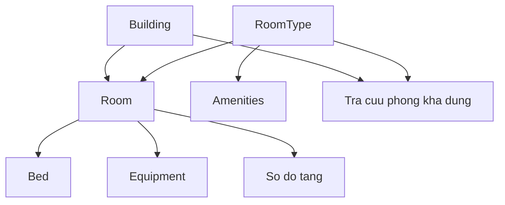
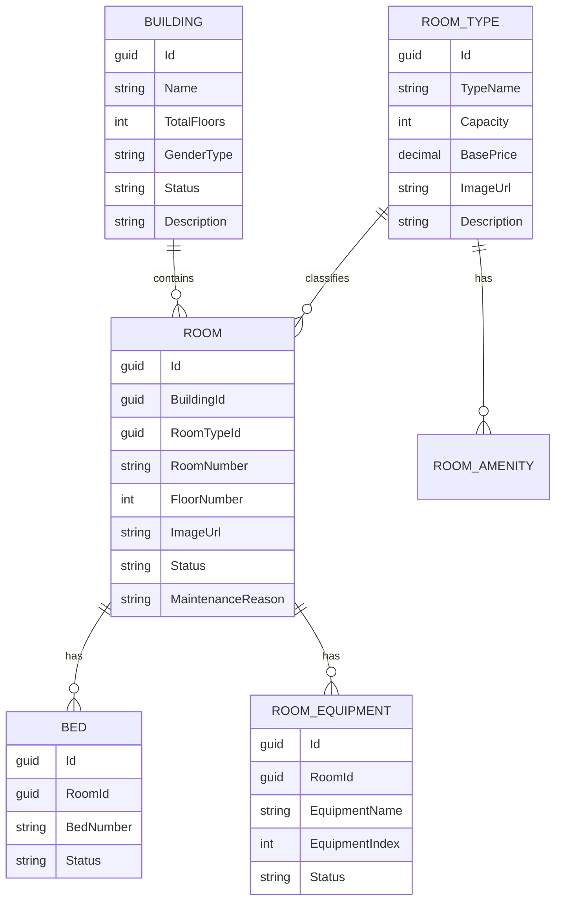
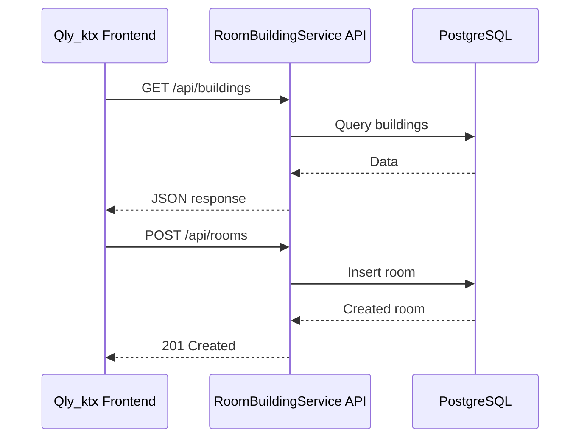

# Room & Building API Guide

Tai lieu nay tong hop API cua nhom 1 - `RoomBuildingService`, dung de:

- demo chuc nang
- ket noi frontend `Qly_ktx`
- cho 2 nhom con lai goi du lieu
- doi chieu nhanh request/response

## 1. Tong quan

Service phu trach cac nghiep vu:

- CRUD toa nha
- CRUD loai phong va tien nghi
- CRUD phong
- Quan ly giuong trong phong
- Quan ly thiet bi trong phong
- Tra cuu phong kha dung
- Xem so do phong theo tang
- Cap nhat trang thai phong

Base URL hien tai tren Render:

```txt
https://roombuildingservice-1ijx.onrender.com
```

Swagger:

```txt
https://roombuildingservice-1ijx.onrender.com/swagger/index.html
```

## 2. So do nghiep vu



## 3. So do quan he du lieu



## 4. Chuan gia tri dung trong API

### GenderType

- `MALE`
- `FEMALE`
- `MIXED`

Backend cung chap nhan:

- `Nam` -> `MALE`
- `Nu` -> `FEMALE`
- `HonHop` -> `MIXED`

### Building Status

- `ACTIVE`
- `INACTIVE`
- `UNDER_MAINTENANCE`

### Room Status

- `AVAILABLE`
- `FULL`
- `UNDER_MAINTENANCE`
- `INACTIVE`

### Bed Status

- `AVAILABLE`
- `OCCUPIED`
- `UNDER_MAINTENANCE`

### Equipment Status

- `ACTIVE`
- `UNDER_MAINTENANCE`
- `BROKEN`
- `RETIRED`

## 5. Bang tong hop API

| Nhom | Method | Endpoint | Muc dich |
|---|---|---|---|
| Building | `GET` | `/api/buildings` | Lay danh sach toa nha |
| Building | `GET` | `/api/buildings/{id}` | Lay chi tiet toa nha |
| Building | `POST` | `/api/buildings` | Tao toa nha |
| Building | `PUT` | `/api/buildings/{id}` | Sua toa nha |
| Building | `DELETE` | `/api/buildings/{id}` | Xoa toa nha |
| RoomType | `GET` | `/api/roomtypes` | Lay danh sach loai phong |
| RoomType | `GET` | `/api/roomtypes/{id}` | Lay chi tiet loai phong |
| RoomType | `POST` | `/api/roomtypes` | Tao loai phong |
| RoomType | `PUT` | `/api/roomtypes/{id}` | Sua loai phong |
| RoomType | `DELETE` | `/api/roomtypes/{id}` | Xoa loai phong |
| Room | `GET` | `/api/rooms` | Lay danh sach phong, co bo loc |
| Room | `GET` | `/api/rooms/{id}` | Lay chi tiet phong |
| Room | `GET` | `/api/rooms/floormap` | Lay phong theo tang |
| Room | `GET` | `/api/rooms/available` | Tra cuu phong kha dung |
| Room | `POST` | `/api/rooms` | Tao phong |
| Room | `PUT` | `/api/rooms/{id}` | Sua phong |
| Room | `PATCH` | `/api/rooms/{id}/status` | Cap nhat trang thai phong |
| Room | `DELETE` | `/api/rooms/{id}` | Xoa phong |
| Bed | `GET` | `/api/beds?roomId=...` | Lay danh sach giuong theo phong |
| Bed | `GET` | `/api/beds/{id}` | Lay chi tiet giuong |
| Bed | `POST` | `/api/beds` | Tao giuong |
| Bed | `PUT` | `/api/beds/{id}` | Sua giuong |
| Bed | `DELETE` | `/api/beds/{id}` | Xoa giuong |
| Equipment | `GET` | `/api/equipments?roomId=...` | Lay thiet bi theo phong |
| Equipment | `GET` | `/api/equipments/{id}` | Lay chi tiet thiet bi |
| Equipment | `POST` | `/api/equipments` | Tao thiet bi |
| Equipment | `PATCH` | `/api/equipments/{id}/status` | Cap nhat trang thai thiet bi |
| Equipment | `DELETE` | `/api/equipments/{id}` | Xoa thiet bi |

## 6. Chi tiet cach goi

### 6.1 Building

#### `GET /api/buildings`

Lay danh sach tat ca toa nha.

```bash
curl https://roombuildingservice-1ijx.onrender.com/api/buildings
```

#### `POST /api/buildings`

Tao toa nha moi.

Request body:

```json
{
  "name": "Toa A",
  "totalFloors": 15,
  "genderType": "MIXED",
  "description": "KTX trung tam"
}
```

#### `PUT /api/buildings/{id}`

Cap nhat toa nha.

```json
{
  "name": "Toa A1",
  "totalFloors": 15,
  "genderType": "MALE",
  "status": "ACTIVE",
  "description": "Da cap nhat"
}
```

Response chinh:

```json
{
  "id": "guid",
  "name": "Toa A",
  "totalFloors": 15,
  "floors": [1, 2, 3],
  "genderType": "MIXED",
  "status": "ACTIVE",
  "description": "KTX trung tam"
}
```

### 6.2 Room Type

#### `GET /api/roomtypes`

Lay danh sach loai phong va danh sach tien nghi.

#### `POST /api/roomtypes`

```json
{
  "typeName": "Phong 4 nguoi",
  "capacity": 4,
  "basePrice": 1200000,
  "imageUrl": "https://example.com/room-4.jpg",
  "description": "Phong tieu chuan",
  "amenities": ["May lanh", "WC rieng", "Ban hoc"]
}
```

#### `PUT /api/roomtypes/{id}`

Body giong `POST`.

Response chinh:

```json
{
  "id": "guid",
  "typeName": "Phong 4 nguoi",
  "capacity": 4,
  "basePrice": 1200000,
  "imageUrl": "https://example.com/room-4.jpg",
  "description": "Phong tieu chuan",
  "amenities": ["May lanh", "WC rieng", "Ban hoc"]
}
```

### 6.3 Room

#### `GET /api/rooms`

Co the loc theo:

- `buildingId`
- `floor`
- `status`

Vi du:

```bash
curl "https://roombuildingservice-1ijx.onrender.com/api/rooms?buildingId=GUID&floor=3&status=AVAILABLE"
```

#### `GET /api/rooms/{id}`

Lay chi tiet phong, kem:

- building
- roomType
- beds
- equipments

#### `GET /api/rooms/floormap`

Dung de ve so do phong theo tang.

Query:

- `buildingId`
- `floor`

Vi du:

```bash
curl "https://roombuildingservice-1ijx.onrender.com/api/rooms/floormap?buildingId=GUID&floor=5"
```

#### `GET /api/rooms/available`

Dung de tra cuu phong kha dung.

Query ho tro:

- `buildingId`
- `roomTypeId`
- `genderType`
- `expectedStartDate`
- `expectedEndDate`

Vi du:

```bash
curl "https://roombuildingservice-1ijx.onrender.com/api/rooms/available?buildingId=GUID&roomTypeId=GUID&genderType=MIXED&expectedStartDate=2026-06-20&expectedEndDate=2026-12-31"
```

Response se tra:

- thong tin phong
- thong tin toa nha
- thong tin loai phong
- `currentOccupancy`
- `availableSlots`

#### `POST /api/rooms`

```json
{
  "buildingId": "guid",
  "roomTypeId": "guid",
  "roomNumber": "A101",
  "floorNumber": 1,
  "imageUrl": "https://example.com/room-a101.jpg"
}
```

#### `PUT /api/rooms/{id}`

```json
{
  "roomTypeId": "guid",
  "roomNumber": "A102",
  "floorNumber": 1,
  "imageUrl": "https://example.com/room-a102.jpg"
}
```

#### `PATCH /api/rooms/{id}/status`

```json
{
  "status": "UNDER_MAINTENANCE",
  "maintenanceReason": "Sua dieu hoa"
}
```

Luu y:

- neu `status = UNDER_MAINTENANCE` thi `maintenanceReason` bat buoc co

### 6.4 Bed

#### `GET /api/beds?roomId={roomId}`

Lay danh sach giuong trong 1 phong.

#### `POST /api/beds`

```json
{
  "roomId": "guid",
  "bedNumber": "101-01"
}
```

#### `PUT /api/beds/{id}`

```json
{
  "bedNumber": "101-01",
  "status": "OCCUPIED"
}
```

### 6.5 Equipment

#### `GET /api/equipments?roomId={roomId}`

Lay danh sach thiet bi theo phong.

#### `POST /api/equipments`

```json
{
  "roomId": "guid",
  "equipmentName": "May lanh"
}
```

#### `PATCH /api/equipments/{id}/status`

```json
{
  "status": "UNDER_MAINTENANCE"
}
```

## 7. Cach frontend dang goi API

Frontend `Qly_ktx` dang goi theo base URL:

```txt
https://roombuildingservice-1ijx.onrender.com
```

Cac file FE chinh:

- `Qly_ktx/src/modules/room-building/api/buildingApi.ts`
- `Qly_ktx/src/modules/room-building/api/roomTypeApi.ts`
- `Qly_ktx/src/modules/room-building/api/roomApi.ts`
- `Qly_ktx/src/modules/room-building/api/bedApi.ts`
- `Qly_ktx/src/modules/room-building/api/equipmentApi.ts`

Luong goi:



## 8. Thu tu goi de demo

Neu demo tu dau, nen goi theo thu tu nay:

1. Tao `Building`
2. Tao `RoomType`
3. Tao `Room`
4. Tao `Bed`
5. Tao `Equipment`
6. Goi `GET /api/rooms`
7. Goi `GET /api/rooms/floormap`
8. Goi `GET /api/rooms/available`
9. Goi `PATCH /api/rooms/{id}/status`

## 9. Luu y nghiep vu

- `Building.TotalFloors` tu dong sinh danh sach `floors`
- `Room.availableSlots` duoc tinh tu `RoomType.Capacity - so giuong OCCUPIED`
- `RoomType.Amenities` la danh sach tien nghi mac dinh cua loai phong
- frontend dang tu them `Equipment` mac dinh theo `Amenities` sau khi tao phong
- `Room status = UNDER_MAINTENANCE` bat buoc co ly do
- `GET /api/rooms/available` co check `expectedStartDate <= expectedEndDate`

## 10. Goi nhanh bang JavaScript

```js
const API_BASE = 'https://roombuildingservice-1ijx.onrender.com'

async function getBuildings() {
  const res = await fetch(`${API_BASE}/api/buildings`)
  return res.json()
}

async function createRoomType() {
  const res = await fetch(`${API_BASE}/api/roomtypes`, {
    method: 'POST',
    headers: { 'Content-Type': 'application/json' },
    body: JSON.stringify({
      typeName: 'Phong 4 nguoi',
      capacity: 4,
      basePrice: 1200000,
      imageUrl: 'https://example.com/room.jpg',
      description: 'Phong tieu chuan',
      amenities: ['May lanh', 'Ban hoc']
    })
  })

  return res.json()
}
```

## 11. Link file code lien quan

- Backend API: [Program.cs](/abs/path/c:/Users/quang/OneDrive/Desktop/Code/QLKTX/RoomBuildingService/src/RoomBuildingService.Api/Program.cs:1)
- Buildings: [BuildingsController.cs](/abs/path/c:/Users/quang/OneDrive/Desktop/Code/QLKTX/RoomBuildingService/src/RoomBuildingService.Api/Controllers/BuildingsController.cs:1)
- RoomTypes: [RoomTypesController.cs](/abs/path/c:/Users/quang/OneDrive/Desktop/Code/QLKTX/RoomBuildingService/src/RoomBuildingService.Api/Controllers/RoomTypesController.cs:1)
- Rooms: [RoomsController.cs](/abs/path/c:/Users/quang/OneDrive/Desktop/Code/QLKTX/RoomBuildingService/src/RoomBuildingService.Api/Controllers/RoomsController.cs:1)
- Beds: [BedsController.cs](/abs/path/c:/Users/quang/OneDrive/Desktop/Code/QLKTX/RoomBuildingService/src/RoomBuildingService.Api/Controllers/BedsController.cs:1)
- Equipments: [EquipmentsController.cs](/abs/path/c:/Users/quang/OneDrive/Desktop/Code/QLKTX/RoomBuildingService/src/RoomBuildingService.Api/Controllers/EquipmentsController.cs:1)

---

Neu can, buoc tiep theo toi co the lam tiep cho ban:

- mot file Postman Collection JSON
- bang mapping API <-> man hinh frontend
- tai lieu ngan gon de nop bao cao/thuyet trinh
