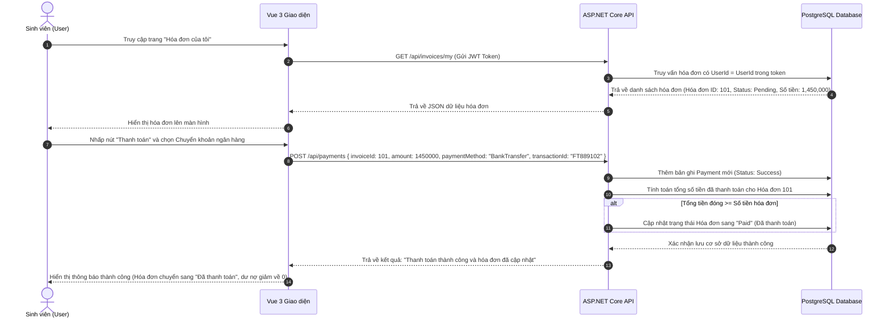
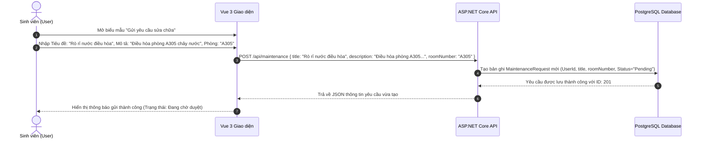
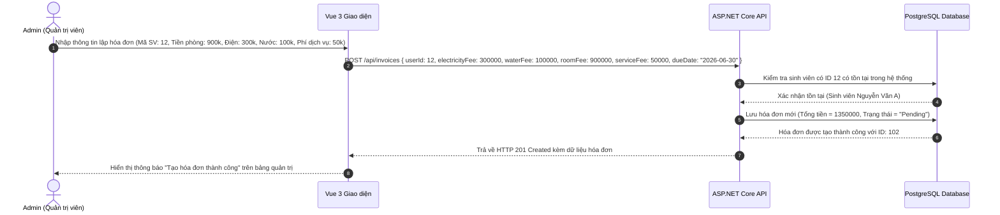
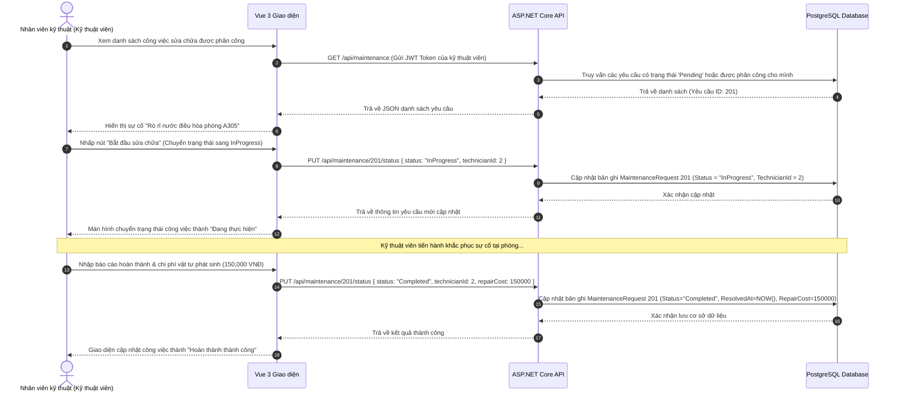

# 📘 Tài liệu Tổng hợp API, Cơ sở Dữ liệu & Tích hợp Hệ thống
## Hệ thống Quản lý Kí túc xá - Dịch vụ Hóa đơn & Bảo trì (Nhóm 3)

Tài liệu này tổng hợp toàn bộ thông tin về API, sơ đồ cơ sở dữ liệu, phân quyền tài khoản và các kịch bản luồng nghiệp vụ đầu cuối (end-to-end) của **Billing & Maintenance Service** (Nhóm 3).

---

## 🗄️ Tổng quan về Cơ sở Dữ liệu

Cơ sở dữ liệu của dịch vụ được xây dựng trên hệ quản trị cơ sở dữ liệu quan hệ PostgreSQL (Render Cloud). Thiết kế dữ liệu tập trung vào việc quản lý thông tin sinh viên, phát hành hóa đơn hàng tháng, ghi nhận lịch sử giao dịch thanh toán và phân công xử lý các yêu cầu bảo trì thiết bị.

### Các bảng dữ liệu chính

1. **Users (Người dùng)**: Lưu trữ thông tin tài khoản, mật khẩu băm, họ tên, vai trò và số phòng.
2. **Invoices (Hóa đơn)**: Lưu trữ thông tin các khoản phí sinh hoạt cần thu (điện, nước, tiền phòng, dịch vụ).
3. **Payments (Thanh toán)**: Lưu trữ lịch sử giao dịch thanh toán hóa đơn.
4. **MaintenanceRequests (Yêu cầu sửa chữa)**: Ghi chép thông tin báo hỏng thiết bị và kết quả sửa chữa.
5. **Technicians (Kỹ thuật viên)**: Danh sách các nhân viên sửa chữa được hệ thống phân công.
6. **Contracts (Hợp đồng phòng)**: Thông tin các hợp đồng nội trú phòng kí túc xá của sinh viên.
7. **Debts (Công nợ)**: Thực thể logic dùng để theo dõi số tiền còn nợ của sinh viên, được truy xuất tối ưu qua Database View `View_Debts`.

---

## 📋 Bảng Tổng hợp Danh sách API

| Phân hệ | Phương thức | Endpoint Route | Mô tả chức năng | Quyền truy cập |
|---|---|---|---|---|
| **Auth** | `POST` | `/api/auth/register` | Đăng ký tài khoản mới | Mọi đối tượng |
| **Auth** | `POST` | `/api/auth/login` | Đăng nhập hệ thống & nhận JWT | Mọi đối tượng |
| **Auth** | `POST` | `/api/auth/refresh` | Làm mới JWT đã hết hạn | Mọi đối tượng |
| **Users** | `GET` | `/api/users` | Lấy danh sách tài khoản | Admin, Manager |
| **Users** | `GET` | `/api/users/{id}` | Lấy chi tiết tài khoản theo ID | Admin, Manager |
| **Users** | `PUT` | `/api/users/{id}` | Cập nhật thông tin tài khoản | Admin, Manager |
| **Users** | `DELETE`| `/api/users/{id}` | Xóa tài khoản khỏi hệ thống | Admin, Manager |
| **Invoices** | `GET` | `/api/invoices` | Lấy danh sách toàn bộ hóa đơn | Admin, Manager, Staff, Tech |
| **Invoices** | `GET` | `/api/invoices/my` | Lấy hóa đơn của sinh viên hiện tại| Student, Admin, Manager |
| **Invoices** | `GET` | `/api/invoices/{id}` | Lấy chi tiết hóa đơn theo ID | Student, Admin, Manager, Staff, Tech |
| **Invoices** | `POST` | `/api/invoices` | Tạo hóa đơn sinh hoạt mới | Admin, Manager, Staff |
| **Invoices** | `PUT` | `/api/invoices/{id}` | Cập nhật thông tin hóa đơn | Admin, Manager, Staff |
| **Invoices** | `DELETE`| `/api/invoices/{id}` | Xóa hóa đơn | Admin, Manager, Staff |
| **Payments** | `POST` | `/api/payments` | Thực hiện thanh toán hóa đơn | Student, Admin, Manager, Staff |
| **Payments** | `GET` | `/api/payments` | Xem toàn bộ lịch sử thanh toán | Admin, Manager, Staff, Tech |
| **Payments** | `GET` | `/api/payments/my` | Xem lịch sử thanh toán cá nhân | Student, Admin, Manager |
| **Maintenance**| `POST` | `/api/maintenance` | Gửi yêu cầu sửa chữa cơ sở vật chất| Student, Admin, Manager |
| **Maintenance**| `GET` | `/api/maintenance` | Xem toàn bộ danh sách yêu cầu | Admin, Manager, Staff, Tech |
| **Maintenance**| `GET` | `/api/maintenance/my` | Xem yêu cầu sửa chữa cá nhân | Student, Admin, Manager |
| **Maintenance**| `PUT` | `/api/maintenance/{id}/status` | Cập nhật trạng thái sửa chữa & phí | Admin, Manager, Staff, Tech |
| **Debts** | `GET` | `/api/debts` | Xem danh sách công nợ toàn hệ thống| Admin, Staff, Tech |
| **Debts** | `GET` | `/api/debts/student/{id}` | Xem chi tiết công nợ của sinh viên | Admin, Staff, Tech, Student |

---

## 👥 Ma trận Phân quyền Tài khoản (Permissions)

| Phân hệ API | Admin | Manager | Staff | Maintenance Staff | Student |
|---|:---:|:---:|:---:|:---:|:---:|
| **Auth** (Xác thực) | ✅ | ✅ | ✅ | ✅ | ✅ |
| **Users** (Tài khoản) | ✅ | ✅ | ❌ | ❌ | ❌ |
| **Invoices** (Hóa đơn) | ✅ | ✅ | ✅ | ✅ (Chỉ xem) | ✅ (Chỉ xem cá nhân) |
| **Payments** (Thanh toán) | ✅ | ✅ | ✅ | ❌ | ✅ (Chỉ trả cho mình) |
| **Maintenance** (Bảo trì) | ✅ | ✅ | ✅ | ✅ (Cập nhật sửa chữa) | ✅ (Chỉ tạo/xem cá nhân) |
| **Debts** (Công nợ) | ✅ | ✅ | ✅ | ✅ (Chỉ xem) | ✅ (Chỉ xem cá nhân) |

---

## 🔄 Các Kịch bản Luồng Nghiệp vụ Đầu - Cuối (End-to-End Workflows)

### 💳 Kịch bản 1: Sinh viên thanh toán hóa đơn trực tuyến
Sinh viên đăng nhập vào hệ thống, kiểm tra hóa đơn điện nước hàng tháng và thanh toán qua Chuyển khoản ngân hàng.

---

### 🔧 Kịch bản 2: Sinh viên gửi yêu cầu sửa chữa thiết bị phòng
Sinh viên báo cáo sự cố hư hỏng điều hòa trong phòng lên ban quản lý.

---

### 📝 Kịch bản 3: Admin quản trị hóa đơn hệ thống
Người quản trị lập hóa đơn sinh hoạt định kỳ cho phòng của sinh viên.

---

### 🛠️ Kịch bản 4: Nhân viên kỹ thuật cập nhật trạng thái sửa chữa
Kỹ thuật viên kiểm tra công việc được phân công, thực hiện sửa chữa và hoàn thành kèm theo chi phí vật tư.

