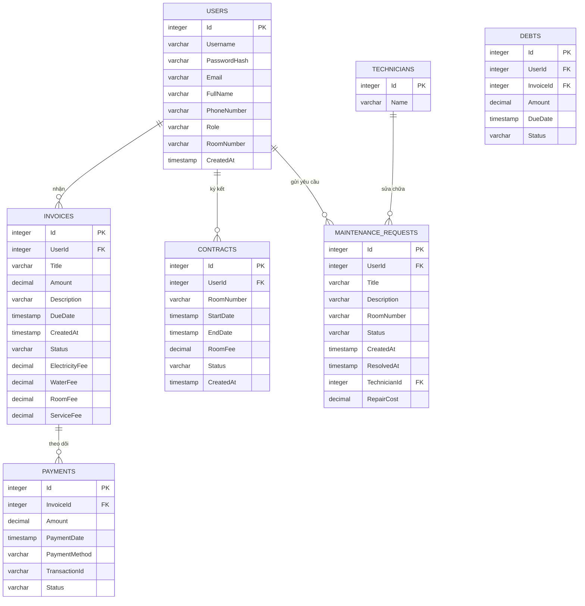

# 🗄️ Tài liệu Thiết kế & Cấu trúc Cơ sở Dữ liệu (Database Schema)
## Hệ thống Quản lý Kí túc xá - Dịch vụ Hóa đơn & Bảo trì (Nhóm 3)

Tài liệu này cung cấp đặc tả kỹ thuật chi tiết về thiết kế cơ sở dữ liệu của Nhóm 3, bao gồm sơ đồ thực thể quan hệ (ERD), bảng từ điển dữ liệu, các ràng buộc và mối liên kết giữa các thực thể được triển khai qua Entity Framework Core và PostgreSQL.

---

## 📊 Sơ đồ Quan hệ Thực thể (Entity-Relationship Diagram - ERD)

Cơ sở dữ liệu quản lý các thực thể liên quan đến người dùng, hợp đồng nội trú, hóa đơn điện nước phòng, lịch sử giao dịch thanh toán và các yêu cầu bảo trì sửa chữa thiết bị. Sơ đồ Mermaid dưới đây biểu diễn trực quan các bảng và mối liên kết:



> [!NOTE]
> Trong triển khai thực tế trên PostgreSQL, bảng **Debts** (Công nợ) có thể được thiết kế như một bảng vật lý được cập nhật tự động bằng code/trigger, hoặc được truy vấn động dưới dạng một **Database View** kết hợp thông tin giữa bảng `Invoices` và `Payments` để tránh dư thừa dữ liệu. Cả hai cách tiếp cận đều được ghi chép cấu trúc chi tiết bên dưới.

---

## 🗃️ Từ điển Dữ liệu & Đặc tả Chi tiết các Bảng

### 1. Bảng: `Users` (Người dùng)
* **Mô tả**: Lưu trữ thông tin tài khoản, mật khẩu đã mã hóa và thông tin cá nhân của tất cả người dùng (Sinh viên, Admin, Quản lý, Nhân viên).
* **Mối quan hệ**:
  * Một - Nhiều với `Invoices` (Một người dùng nhận được nhiều hóa đơn theo tháng).
  * Một - Nhiều với `Contracts` (Một người dùng có thể ký nhiều hợp đồng/gia hạn hợp đồng).
  * Một - Nhiều với `MaintenanceRequests` (Một người dùng gửi nhiều yêu cầu sửa chữa).

| Tên Cột | Kiểu Dữ Liệu (Postgres) | Kiểu C# | Ràng buộc | Mô tả chi tiết |
|---|---|---|---|---|
| `Id` | `SERIAL` (int4) | `int` | **PK**, `NOT NULL`, Tự tăng | Khóa chính duy nhất. |
| `Username` | `VARCHAR` | `string` | `NOT NULL`, `UNIQUE` | Tên tài khoản đăng nhập. |
| `PasswordHash` | `VARCHAR` | `string` | `NOT NULL` | Mật khẩu đã băm (Sử dụng PasswordHasher). |
| `Email` | `VARCHAR` | `string` | `NOT NULL`, `DEFAULT ''` | Địa chỉ email liên hệ. |
| `FullName` | `VARCHAR` | `string` | `NOT NULL`, `DEFAULT ''` | Họ và tên đầy đủ. |
| `PhoneNumber` | `VARCHAR` | `string` | `NOT NULL`, `DEFAULT ''` | Số điện thoại liên lạc. |
| `Role` | `VARCHAR` | `string` | `NOT NULL`, `DEFAULT 'Student'` | Vai trò (`Admin`, `Manager`, `Staff`, `MaintenanceStaff`, `Student`). |
| `RoomNumber` | `VARCHAR` | `string` | `NULL` | Số phòng nội trú hiện tại. |
| `CreatedAt` | `TIMESTAMP` | `DateTime` | `NOT NULL`, `DEFAULT NOW()` | Thời gian tạo tài khoản (UTC). |

---

### 2. Bảng: `Invoices` (Hóa đơn)
* **Mô tả**: Lưu trữ các hóa đơn hàng tháng được tạo ra cho sinh viên. Bao gồm phí thuê phòng, phí tiền điện, tiền nước và phí dịch vụ chung.
* **Mối quan hệ**:
  * Nhiều - Một với `Users` (Nhiều hóa đơn thuộc về một Sinh viên).
  * Một - Nhiều với `Payments` (Một hóa đơn có thể có nhiều lượt thử thanh toán/thanh toán từng phần).

| Tên Cột | Kiểu Dữ Liệu (Postgres) | Kiểu C# | Ràng buộc | Mô tả chi tiết |
|---|---|---|---|---|
| `Id` | `SERIAL` (int4) | `int` | **PK**, `NOT NULL`, Tự tăng | Khóa chính duy nhất. |
| `UserId` | `INT` | `int` | **FK** liên kết `Users(Id)`, `NOT NULL` | Mã sinh viên nhận hóa đơn. |
| `Title` | `VARCHAR` | `string` | `NOT NULL`, `DEFAULT ''` | Tiêu đề hóa đơn (Ví dụ: Hóa đơn điện nước T6/2026). |
| `Amount` | `NUMERIC(18,2)` | `decimal` | `NOT NULL` | Tổng số tiền cần đóng (Tổng của 4 loại phí bên dưới). |
| `Description` | `VARCHAR` | `string` | `NOT NULL`, `DEFAULT ''` | Mô tả chi tiết hoặc thông tin ghi chú. |
| `DueDate` | `TIMESTAMP` | `DateTime` | `NOT NULL` | Hạn chót phải hoàn thành thanh toán. |
| `CreatedAt` | `TIMESTAMP` | `DateTime` | `NOT NULL`, `DEFAULT NOW()` | Ngày phát hành hóa đơn. |
| `Status` | `VARCHAR` | `string` | `NOT NULL`, `DEFAULT 'Unpaid'` | Trạng thái thanh toán (`Unpaid`, `Paid`, `Overdue`, `Cancelled`). |
| `ElectricityFee` | `NUMERIC(18,2)` | `decimal` | `NOT NULL`, `DEFAULT 0.0` | Tiền điện tiêu thụ trong phòng. |
| `WaterFee` | `NUMERIC(18,2)` | `decimal` | `NOT NULL`, `DEFAULT 0.0` | Tiền nước tiêu thụ. |
| `RoomFee` | `NUMERIC(18,2)` | `decimal` | `NOT NULL`, `DEFAULT 0.0` | Tiền thuê phòng định kỳ. |
| `ServiceFee` | `NUMERIC(18,2)` | `decimal` | `NOT NULL`, `DEFAULT 0.0` | Phí dịch vụ quản lý kí túc xá. |

---

### 3. Bảng: `Payments` (Giao dịch Thanh toán)
* **Mô tả**: Ghi nhận các giao dịch thanh toán của sinh viên cho một hóa đơn cụ thể.
* **Mối quan hệ**:
  * Nhiều - Một với `Invoices` (Nhiều giao dịch thanh toán thuộc về một hóa đơn).

| Tên Cột | Kiểu Dữ Liệu (Postgres) | Kiểu C# | Ràng buộc | Mô tả chi tiết |
|---|---|---|---|---|
| `Id` | `SERIAL` (int4) | `int` | **PK**, `NOT NULL`, Tự tăng | Khóa chính duy nhất. |
| `InvoiceId` | `INT` | `int` | **FK** liên kết `Invoices(Id)`, `NOT NULL` | Liên kết đến hóa đơn cần trả. |
| `Amount` | `NUMERIC(18,2)` | `decimal` | `NOT NULL` | Số tiền thực hiện giao dịch. |
| `PaymentDate` | `TIMESTAMP` | `DateTime` | `NOT NULL`, `DEFAULT NOW()` | Ngày giờ giao dịch được tạo. |
| `PaymentMethod` | `VARCHAR` | `string` | `NOT NULL` | Phương thức (`Cash`, `BankTransfer`, `EWallet`). |
| `TransactionId` | `VARCHAR` | `string` | `NOT NULL`, `DEFAULT ''` | Mã giao dịch ngân hàng hoặc cổng thanh toán. |
| `Status` | `VARCHAR` | `string` | `NOT NULL`, `DEFAULT 'Pending'` | Trạng thái giao dịch (`Pending`, `Success`, `Failed`). |

---

### 4. Bảng: `MaintenanceRequests` (Yêu cầu Sửa chữa)
* **Mô tả**: Quản lý các sự cố cơ sở vật chất phòng do sinh viên gửi lên và cập nhật kết quả xử lý của nhân viên kỹ thuật.
* **Mối quan hệ**:
  * Nhiều - Một với `Users` (Nhiều yêu cầu báo hỏng được gửi bởi một Sinh viên).
  * Nhiều - Một với `Technicians` (Nhiều yêu cầu được phân công cho một Kỹ thuật viên).

| Tên Cột | Kiểu Dữ Liệu (Postgres) | Kiểu C# | Ràng buộc | Mô tả chi tiết |
|---|---|---|---|---|
| `Id` | `SERIAL` (int4) | `int` | **PK**, `NOT NULL`, Tự tăng | Khóa chính duy nhất. |
| `UserId` | `INT` | `int` | **FK** liên kết `Users(Id)`, `NOT NULL` | Người gửi yêu cầu báo hỏng. |
| `Title` | `VARCHAR` | `string` | `NOT NULL` | Tên sự cố tóm tắt (Ví dụ: Cháy bóng đèn). |
| `Description` | `VARCHAR` | `string` | `NOT NULL` | Mô tả chi tiết hiện trạng hỏng hóc. |
| `RoomNumber` | `VARCHAR` | `string` | `NOT NULL` | Số phòng nơi xảy ra sự cố cần sửa. |
| `Status` | `VARCHAR` | `string` | `NOT NULL`, `DEFAULT 'Pending'` | Trạng thái sửa chữa (`Pending`, `Approved`, `InProgress`, `Completed`, `Cancelled`). |
| `CreatedAt` | `TIMESTAMP` | `DateTime` | `NOT NULL`, `DEFAULT NOW()` | Thời gian sinh viên tạo yêu cầu. |
| `ResolvedAt` | `TIMESTAMP` | `DateTime` | `NULL` | Thời gian sửa xong. |
| `TechnicianId` | `INT` | `int` | **FK** liên kết `Technicians(Id)`, `NULL` | Kỹ thuật viên được phân công. |
| `RepairCost` | `NUMERIC(18,2)` | `decimal` | `NULL` | Chi phí vật tư phát sinh sau khi hoàn thành. |

---

### 5. Bảng: `Technicians` (Kỹ thuật viên)
* **Mô tả**: Danh sách nhân viên kỹ thuật chịu trách nhiệm sửa chữa các trang thiết bị hỏng hóc.
* **Mối quan hệ**:
  * Một - Nhiều với `MaintenanceRequests` (Một kỹ thuật viên giải quyết nhiều yêu cầu bảo trì).

| Tên Cột | Kiểu Dữ Liệu (Postgres) | Kiểu C# | Ràng buộc | Mô tả chi tiết |
|---|---|---|---|---|
| `Id` | `SERIAL` (int4) | `int` | **PK**, `NOT NULL`, Tự tăng | Khóa chính duy nhất. |
| `Name` | `VARCHAR(100)` | `string` | `NOT NULL` | Họ tên kỹ thuật viên. |

---

### 6. Bảng: `Contracts` (Hợp đồng phòng)
* **Mô tả**: Quản lý lịch sử hợp đồng đăng ký phòng kí túc xá của sinh viên, dùng làm đối chiếu đơn giá phòng chuẩn.
* **Mối quan hệ**:
  * Nhiều - Một với `Users` (Nhiều hợp đồng ký bởi một Sinh viên).

| Tên Cột | Kiểu Dữ Liệu (Postgres) | Kiểu C# | Ràng buộc | Mô tả chi tiết |
|---|---|---|---|---|
| `Id` | `SERIAL` (int4) | `int` | **PK**, `NOT NULL`, Tự tăng | Khóa chính duy nhất. |
| `UserId` | `INT` | `int` | **FK** liên kết `Users(Id)`, `NOT NULL` | Mã tài khoản sinh viên ký hợp đồng. |
| `RoomNumber` | `VARCHAR` | `string` | `NOT NULL` | Mã số phòng đăng ký ở. |
| `StartDate` | `TIMESTAMP` | `DateTime` | `NOT NULL` | Ngày bắt đầu hiệu lực hợp đồng. |
| `EndDate` | `TIMESTAMP` | `DateTime` | `NOT NULL` | Ngày kết thúc hiệu lực hợp đồng. |
| `RoomFee` | `NUMERIC(18,2)` | `decimal` | `NOT NULL` | Giá phòng mỗi tháng theo thỏa thuận. |
| `Status` | `VARCHAR` | `string` | `NOT NULL`, `DEFAULT 'Active'` | Trạng thái (`Active`, `Expired`, `Terminated`). |
| `CreatedAt` | `TIMESTAMP` | `DateTime` | `NOT NULL`, `DEFAULT NOW()` | Ngày ký kết hợp đồng. |

---

### 7. Thực thể / Bảng logic: `Debts` (Công nợ sinh viên)
* **Mô tả**: Theo dõi các khoản nợ của từng sinh viên đối với các hóa đơn chưa thanh toán xong.
* **Định nghĩa Database View (Được khuyến nghị để truy xuất động)**:
  ```sql
  CREATE VIEW View_Debts AS
  SELECT 
      u.Id AS UserId,
      u.Username,
      u.FullName,
      u.Email,
      COALESCE(SUM(i.Amount), 0) AS TotalInvoiceAmount,
      COALESCE(SUM(p.Amount), 0) AS TotalPaidAmount,
      (COALESCE(SUM(i.Amount), 0) - COALESCE(SUM(p.Amount), 0)) AS RemainingDebt
  FROM Users u
  LEFT JOIN Invoices i ON u.Id = i.UserId AND i.Status != 'Cancelled'
  LEFT JOIN Payments p ON i.Id = p.InvoiceId AND p.Status = 'Success'
  GROUP BY u.Id, u.Username, u.FullName, u.Email;
  ```

| Tên Cột | Kiểu Dữ Liệu | Ràng buộc | Mô tả chi tiết |
|---|---|---|---|
| `Id` | `SERIAL` | **PK** (Nếu là bảng vật lý) | Khóa chính của bản ghi công nợ. |
| `UserId` | `INT` | **FK** liên kết `Users(Id)` | Sinh viên mắc nợ. |
| `InvoiceId` | `INT` | **FK** liên kết `Invoices(Id)` | Hóa đơn chưa thanh toán. |
| `Amount` | `NUMERIC(18,2)`| `NOT NULL` | Số tiền công nợ còn lại của hóa đơn này. |
| `DueDate` | `TIMESTAMP` | `NOT NULL` | Hạn chót đóng tiền. |
| `Status` | `VARCHAR` | `NOT NULL` | Trạng thái nợ (`Active`, `Cleared`, `Overdue`). |
