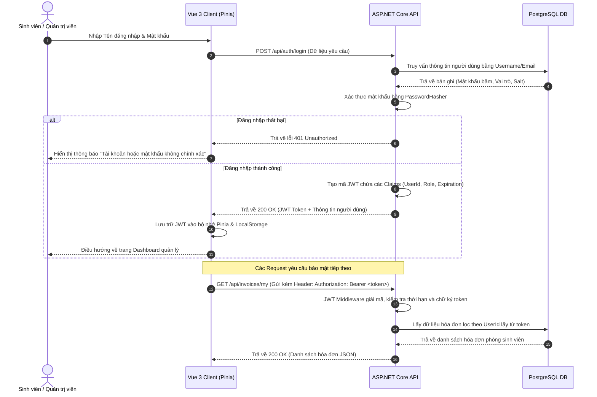
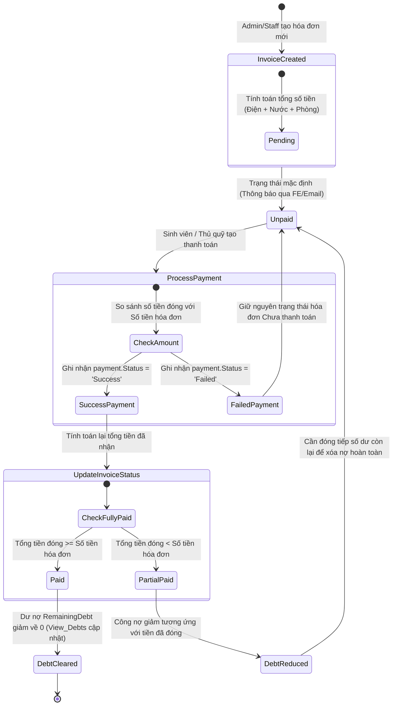

# 🏛️ Tài liệu Kiến trúc Hệ thống (System Architecture)
## Hệ thống Quản lý Kí túc xá - Dịch vụ Hóa đơn & Bảo trì (Nhóm 3)

Tài liệu này mô tả chi tiết sơ đồ kiến trúc hệ thống, cấu trúc các tầng công nghệ (Stack), phương án triển khai hạ tầng, và các luồng dữ liệu nghiệp vụ cốt lõi của **Billing & Maintenance Service** (Dịch vụ Hóa đơn & Bảo trì).

---

## 🏗️ Tổng quan về Kiến trúc

Hệ thống được thiết kế theo mô hình **Client-Server (N-Tier Architecture)** (Kiến trúc phân tầng) để đảm bảo tách biệt các thành phần độc lập, dễ bảo trì, nâng cấp mở rộng và tối ưu hóa khi deploy.

```
┌─────────────────────────────────────────────────────────┐
│                     Tầng Giao Diện                      │
│        Vue 3 Single Page Application (SPA) / Vite       │
└────────────────────────────┬────────────────────────────┘
                             │ HTTPS (Dữ liệu JSON + JWT)
                             ▼
┌─────────────────────────────────────────────────────────┐
│                     Tầng Nghiệp Vụ                      │
│                 ASP.NET Core 8.0 Web API                │
│       Controllers ──► Services ──► DB Context (EF)      │
└────────────────────────────┬────────────────────────────┘
                             │ Driver ADO.NET (Npgsql)
                             ▼
┌─────────────────────────────────────────────────────────┐
│                    Tầng Dữ Liệu (DB)                    │
│            Cơ sở dữ liệu quan hệ PostgreSQL             │
└─────────────────────────────────────────────────────────┘
```

### 💻 Tầng Giao diện (Client-side Frontend)
* **Framework chính**: **Vue 3** (Sử dụng Composition API) - Đem lại giao diện phản hồi nhanh và hướng thành phần linh hoạt.
* **Hệ thống Build**: **Vite** - Tăng tốc thời gian chạy dev server cục bộ và tối ưu hóa mã nguồn đóng gói khi build production.
* **Quản lý State**: **Pinia** - Lưu trữ trạng thái đăng nhập toàn cục, lưu trữ JWT token và các thông tin cài đặt giao diện.
* **Quản lý Định tuyến**: **Vue Router** - Điều hướng trang phía client-side, cấu hình các bộ lọc điều hướng (Navigation Guards) để kiểm tra phân quyền JWT.
* **Phong cách Giao diện (CSS)**: Sử dụng Vanilla CSS tùy chỉnh với hệ thống biến màu HSL và bố cục linh hoạt Flexbox/Grid.

### ⚙️ Tầng Nghiệp vụ (Server-side Backend)
* **Framework chính**: **ASP.NET Core Web API 8.0** - Đảm bảo hiệu năng xử lý RESTful API cao, hỗ trợ Dependency Injection tích hợp sẵn và bộ lọc Middleware phân quyền.
* **Bộ chuyển đổi ORM**: **Entity Framework Core (EF Core)** - Thực hiện ánh xạ dữ liệu Code-First, quản lý lịch sử Migration và biên dịch các câu truy vấn LINQ thành SQL.
* **Kết nối Database**: **Npgsql.EntityFrameworkCore.PostgreSQL** - Thư viện driver kết nối chính thức giữa EF Core và CSDL PostgreSQL.
* **Bảo mật**: **Xác thực JWT Bearer** - Middleware tự động giải mã chữ ký token, đọc các Claims (UserId, Role, Username) để áp dụng phân quyền RBAC.

### 🚀 Triển khai Hạ tầng (Deployment)
* **Nền tảng Cloud**: **Render Cloud**
  * **Frontend**: Deploy dạng Static Site kết nối với mạng phân phối nội dung Render CDN.
  * **Backend**: Đóng gói Docker Container (qua tệp `Dockerfile`) và chạy như một Web Service độc lập.
  * **Database**: Thuê máy chủ PostgreSQL được quản lý trọn gói (Managed Database) từ Render.

---

## 🔑 Luồng Xác thực Tài khoản (JWT Login Flow)

Sơ đồ dưới đây thể hiện quy trình đăng nhập từ client, nhận JWT token từ API và gửi các request tiếp theo kèm theo token:



---

## 💸 Luồng Xử lý Hóa đơn & Thanh toán

Quy trình thể hiện vòng đời của một hóa đơn từ lúc phát hành, sinh viên thực hiện thanh toán trực tuyến, và hệ thống tự động cập nhật công nợ còn lại.



---

## 🔧 Luồng Nghiệp vụ Sửa chữa & Bảo trì

Sơ đồ quy trình xử lý một yêu cầu sửa chữa cơ sở vật chất từ lúc sinh viên gửi báo cáo đến lúc hoàn thành và hạch toán chi phí.

```mermaid
flowchart TD
    A[Sinh viên gửi yêu cầu báo hỏng] -->|POST /api/maintenance| B(Trạng thái: Pending)
    B -->|Admin duyệt yêu cầu| C{Yêu cầu hợp lệ?}
    C -->|Không| D[Trạng thái: Cancelled]
    C -->|Có| E[Admin phân công kỹ thuật viên]
    
    E -->|PUT /api/maintenance/id/status| F(Trạng thái: Approved / Phân công xong)
    F -->|Kỹ thuật viên bắt đầu sửa| G(Trạng thái: InProgress)
    
    G -->|Hoàn thành sửa & cập nhật chi phí| H(Trạng thái: Completed)
    H -->|Hệ thống lưu Ngày hoàn thành & Chi phí| I[Lập hóa đơn phụ thu nếu do lỗi sinh viên làm hỏng]
    
    D --> [*]
    I --> [*]

    style A fill:#e1f5fe,stroke:#03a9f4,stroke-width:2px
    style B fill:#fff9c4,stroke:#fbc02d,stroke-width:2px
    style D fill:#ffe0b2,stroke:#f57c00,stroke-width:2px
    style F fill:#e8f5e9,stroke:#4caf50,stroke-width:2px
    style G fill:#bbdefb,stroke:#2196f3,stroke-width:2px
    style H fill:#c8e6c9,stroke:#388e3c,stroke-width:2px
```
